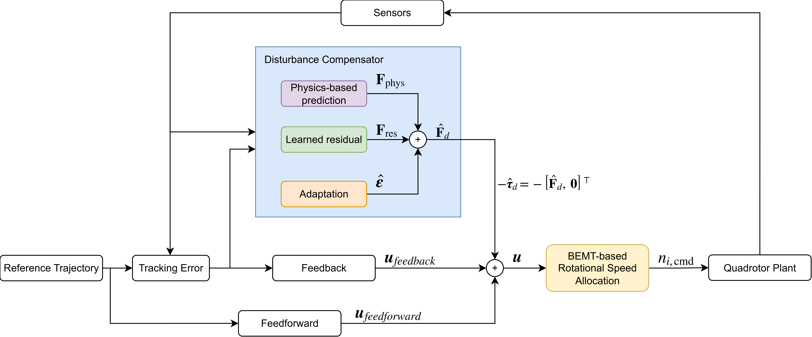
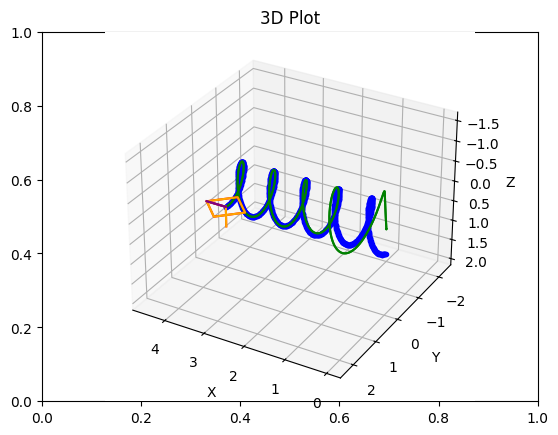
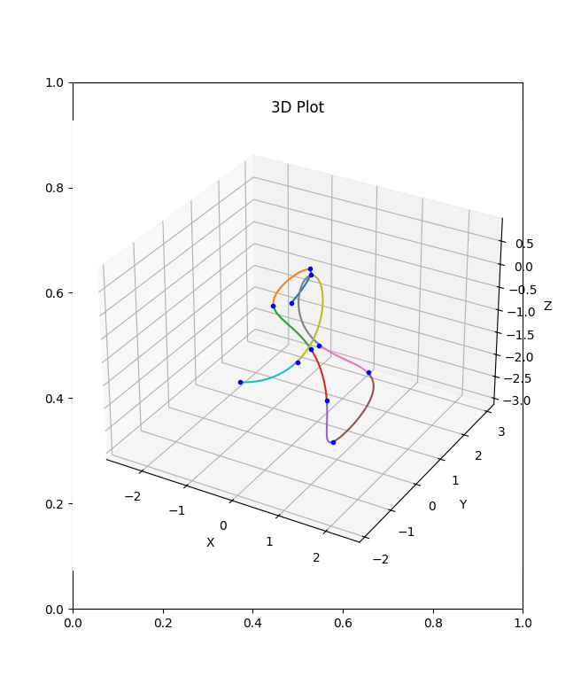

# Aerial Robot Testbed
This repository provides a experimental platform to explore novel control and planning methods for aerial robots.

## Introduction

This repository is the original development testbed for [5] and consists of the following modules:

### 1) Drone dynamics simulation with wind flow


### 2) Learning-based controller (implemented following [5])

<table>
  <tr>
    <td></td>
    <td></td>
  </tr>
</table>

### 3) Trajectory generation (based on [3])


### 4) Replication and extensions of [4]

## How-to
In each module directory, there is at least one user manual .ipynb, which is ready to run. 

To run a specific module, use the following command to ensure the dependencies are properly called:

```bash
python -m <module_name>
```

To run all unit tests, in the repo root folder, run 

```bash
python -m unittest discover -s . -p "*_test.py"
```

## Reference  
[1]: Link to Neural-fly repo: https://github.com/aerorobotics/neural-fly  
[2]: Lee, Taeyoung, Melvin Leok, and N. Harris McClamroch. "Geometric tracking control of a quadrotor UAV on SE (3)." 49th IEEE conference on decision and control (CDC). IEEE, 2010.  
[3]: Mellinger, Daniel, and Vijay Kumar. "Minimum snap trajectory generation and control for quadrotors." 2011 IEEE international conference on robotics and automation. IEEE, 2011.  
[4]: O’Connell, Michael, et al. "Neural-fly enables rapid learning for agile flight in strong winds." Science Robotics 7.66 (2022): eabm6597.  
[5]: Zhang, Yiming, and Junyi Geng. "Physics-infused Learning for Aerial Manipulator in Winds and Near-Wall Environments." AIAA SCITECH 2026 Forum. 2026.
