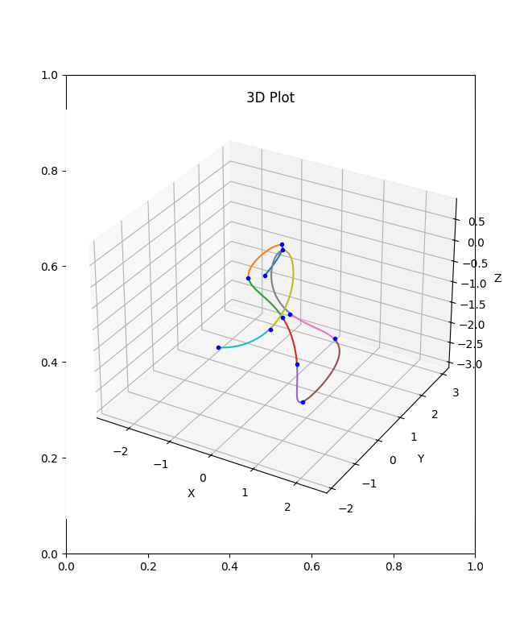

# Neural-fly applied in python simulation 
This repo replicates Neural-Fly[1] project in a simulation environment. 

## Introduction

The repo is consisted with the following modules:  
- a drone dynamic simulation environment
- a drone controller based on [2]
- a trajectory generator based on [3]
- a replication of [4] 

## Demo
The simulation environment can produce the drone flight trace and its reference path.  
  
The trajectory generator can produce a randomly sampled trajectory.  

## Reference  
[1]: Link to Neural-fly repo: https://github.com/aerorobotics/neural-fly  
[2]: Lee, Taeyoung, Melvin Leok, and N. Harris McClamroch. "Geometric tracking control of a quadrotor UAV on SE (3)." 49th IEEE conference on decision and control (CDC). IEEE, 2010.  
[3]: Mellinger, Daniel, and Vijay Kumar. "Minimum snap trajectory generation and control for quadrotors." 2011 IEEE international conference on robotics and automation. IEEE, 2011.  
[4]: O’Connell, Michael, et al. "Neural-fly enables rapid learning for agile flight in strong winds." Science Robotics 7.66 (2022): eabm6597.  